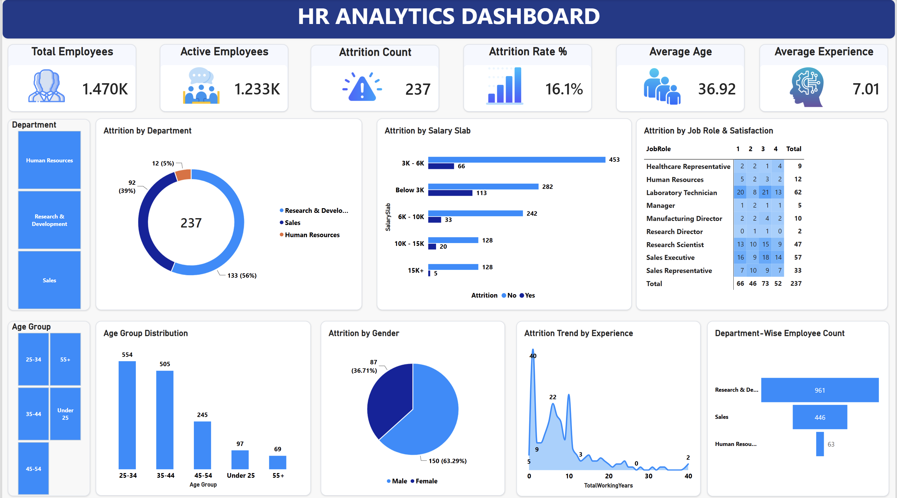

# HR Analytics Attrition Dashboard

Power BI dashboard analyzing employee attrition patterns using the IBM HR Analytics dataset (1,470 employees, 35 variables), 
with an embedded Power App for logging HR follow-up actions on flagged employees.

## What it does

- Tracks headcount, attrition rate, and average tenure across department, job role, salary band, and age group
- Cross-tabulates job role against satisfaction level to surface where attrition concentrates
- Embeds a Power App (backed by a SharePoint list) directly into the report, so identifying a flagged employee 
  and logging a retention action happens in one screen
- Automated with Power BI scheduled refresh via a OneDrive-connected source

## Tools

Power BI (DAX, Power Query), Power Apps, SharePoint, Excel

## Key insight

Attrition doesn't concentrate purely at low satisfaction scores — the highest attrition count actually falls at a mid-level 
satisfaction rating, suggesting compensation or role-fit factors matter as much as stated satisfaction.

## Visual

## Files

- `HRanalysis.pbix` — Power BI report file
- `screenshots/dashboard-view.png` — dashboard and Power App views
